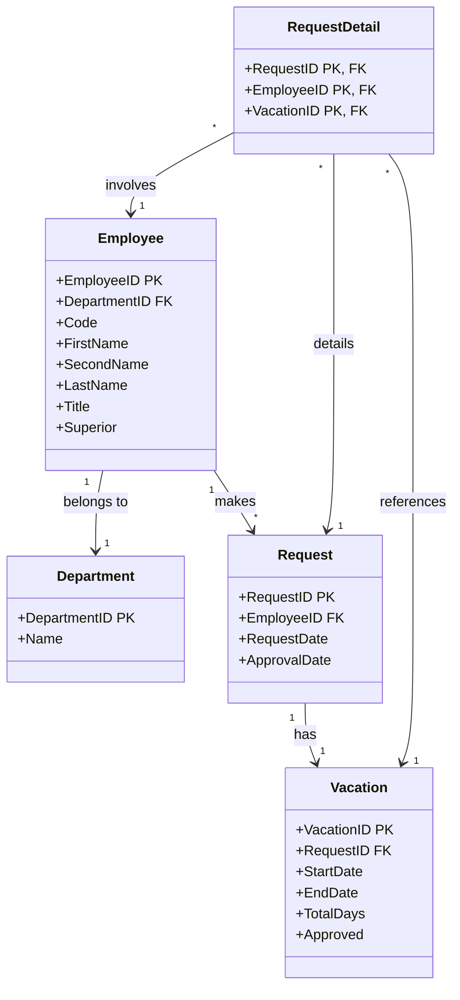

# Vacation Management System

## Project Summary
A comprehensive SQL database system designed to manage employee vacation requests and approvals. The system features a normalized database structure, complex relationships between employees, departments, requests, and vacations, with robust data validation and business rules implementation.

## Key Technical Highlights

### Database Architecture
- Fully normalized database design (3NF)
- Complex entity relationships
  - Employee to Department (Many-to-One)
  - Employee to Request (One-to-Many)
  - Request to Vacation (One-to-Many)
  - RequestDetail as a junction table
- Primary and Foreign key constraints
- Referential integrity implementation
- Comprehensive data validation rules

### Core Entities

#### Employee Management
- Unique employee identification
- Department association
- Employee hierarchy (Superior-Subordinate relationship)
- Employee metadata (First Name, Last Name, Title)
- Employee code tracking

#### Vacation Request Processing
- Request lifecycle tracking
- Approval workflow
- Date range management
- Total days calculation
- Request status monitoring

#### Department Organization
- Department hierarchy
- Department code management
- Name standardization

### Advanced SQL Features

#### Query Implementation
- Complex JOIN operations
  - INNER JOINs for related data
  - LEFT OUTER JOINs for optional relationships
- Subqueries for hierarchical data
- Common Table Expressions (CTEs)
- Window functions for analysis

#### Data Operations
- Transaction management
- Date/Time calculations
- Aggregate functions
- String manipulations
- Data validation procedures
- Error handling

### System Features
- Automated total days calculation
- Request status tracking
- Approval workflow
- Date conflict validation
- Employee history maintenance
- Department structure management

## Database Schema

### Class Diagram


### Main Tables
- Employee
  - EmployeeID (PK)
  - DepartmentID (FK)
  - Code
  - FirstName
  - SecondName
  - LastName
  - Title
  - Superior

- Department
  - DepartmentID (PK)
  - Name

- Request
  - RequestID (PK)
  - EmployeeID (FK)
  - RequestDate
  - ApprovalDate

- Vacation
  - VacationID (PK)
  - RequestID (FK)
  - StartDate
  - EndDate
  - TotalDays
  - Approved

- RequestDetail
  - RequestID (PK, FK)
  - EmployeeID (PK, FK)
  - VacationID (PK, FK)

## Technical Requirements
- SQL Server 2019 or later
- Support for advanced T-SQL features
- Minimum 8GB RAM recommended
- SSD storage recommended for optimal performance

## Installation Steps
1. Create new database
2. Run schema creation scripts
3. Execute initial data population scripts
4. Configure user permissions
5. Verify database connectivity

## Usage Examples

### Request Creation
```sql
INSERT INTO Request (EmployeeID, RequestDate)
VALUES (@EmployeeID, GETDATE());

INSERT INTO Vacation (RequestID, StartDate, EndDate, TotalDays)
VALUES (@RequestID, @StartDate, @EndDate, DATEDIFF(day, @StartDate, @EndDate) + 1);
```

### Approval Process
```sql
UPDATE Vacation
SET Approved = 1,
    ApprovalDate = GETDATE()
WHERE RequestID = @RequestID
AND VacationID = @VacationID;
```

### Request Status Query
```sql
SELECT 
    e.FirstName + ' ' + e.LastName AS EmployeeName,
    r.RequestDate,
    v.StartDate,
    v.EndDate,
    v.TotalDays,
    v.Approved
FROM Employee e
JOIN Request r ON e.EmployeeID = r.EmployeeID
JOIN Vacation v ON r.RequestID = v.RequestID
WHERE e.DepartmentID = @DepartmentID;
```

## Performance Considerations
- Indexed views for frequently accessed data
- Optimized query patterns
- Regular index maintenance
- Statistics updates
- Regular backup strategy

## Security Implementation
- Role-based access control
- Data encryption
- Audit logging
- Secure connection requirements

## License
Copyright (c) 2024 Claudia Souza
All rights reserved.
